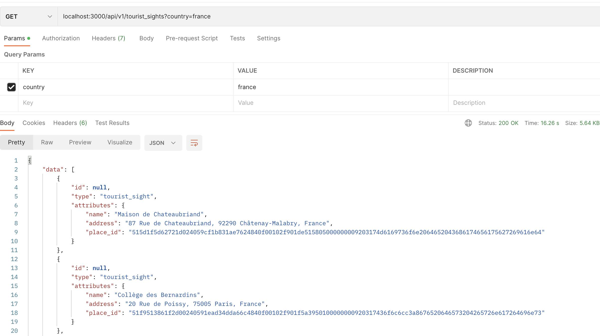

<!-- Improved compatibility of back to top link: See: https://github.com/marchandmd/2208-final-assessment-starter/pull/73 -->

<a name="readme-top"></a>

<!--
*** Thanks for checking out the 2208-final-assessment-starter. If you have a suggestion
*** that would make this better, please fork the repo and create a pull request
*** or simply open an issue with the tag "enhancement".
*** Don't forget to give the project a star!
*** Thanks again! Now go create something AMAZING! :D
-->

<!-- PROJECT SHIELDS -->
<!--
*** I'm using markdown "reference style" links for readability.
*** Reference links are enclosed in brackets [ ] instead of parentheses ( ).
*** See the bottom of this document for the declaration of the reference variables
*** for contributors-url, forks-url, etc. This is an optional, concise syntax you may use.
*** https://www.markdownguide.org/basic-syntax/#reference-style-links
-->

[![Contributors][contributors-shield]][contributors-url]
[![Forks][forks-shield]][forks-url]
[![Stargazers][stars-shield]][stars-url]
[![Issues][issues-shield]][issues-url]
[![MIT License][license-shield]][license-url]
[![LinkedIn][linkedin-shield]][linkedin-url]

<!-- PROJECT LOGO -->
<br />
<div align="center">

  <h1 align="center">Tourist Sights API</h1>

  <p align="center">
    <h3>Consuming, Aggregating and Exposing API endpoint data</h3>
    <br />
    
    <br />
    <a href="https://www.theodinproject.com/lessons/ruby-2208-final-assessment-starter"><strong>Explore the docs »</strong></a>
    <br />
    <br />
    <a href="https://github.com/marchandmd/2208-final-assessment-starter">View Demo</a>
    ||
    <a href="https://github.com/marchandmd/2208-final-assessment-starter/issues">Report Bug</a>
    ||
    <a href="https://github.com/marchandmd/2208-final-assessment-starter/issues">Request Feature</a>
  </p>
</div>


<!-- TABLE OF CONTENTS -->
<details>
  <summary>Table of Contents</summary>
  <ol>
    <li>
      <a href="#about-the-project">About The Project</a>
      <ul>
        <li><a href="#built-with">Built With</a></li>
      </ul>
    </li>
    <li>
      <a href="#getting-started">Getting Started</a>
      <ul>
        <li><a href="#prerequisites">Prerequisites</a></li>
        <li><a href="#installation">Installation</a></li>
      </ul>
    </li>
    <li><a href="#usage">Usage</a></li>
    <li><a href="#roadmap">Roadmap</a></li>
    <li><a href="#contributing">Contributing</a></li>
    <li><a href="#license">License</a></li>
    <li><a href="#contact">Contact</a></li>
    <li><a href="#acknowledgments">Acknowledgments</a></li>
  </ol>
</details>

## About The Project

The idea here was to create an API-only app that consumes multiple APIs and aggregates the data, and to do so quickly. This was achieved within 2 hours.

What did I learn building this:

- Properly building Services, Facades, and POROs
- Building test-first unit and integration level tests


<p align="right">(<a href="#readme-top">back to top</a>)</p>

### Built With

-   [![Ruby][ruby.com]][ruby-url]
-   [![Rspec][rspec.com]][rspec-url]
-   [![Rails][rails.com]][rspec-url]

<p align="right">(<a href="#readme-top">back to top</a>)</p>
<!-- GETTING STARTED -->

## Getting Started


You will need to sign up for an api key for the [Geocoding Service](https://api-ninjas.com/api/geocoding).

To get your repo set up, please do the following:
1. Fork and clone this repository onto your local machine
2. `cd final_assessment_starter_2208`
3. `bundle install`
4. `rails db:{create,migrate}`
5. `bundle exec figaro install`
6. In your `application.yml`, assign your geocoding api key with the variable `api-ninja-key`

## Make sure it's working locally:
1. Run `bundle exec rspec`. You should have 5 passing tests.
2. Run `rails s`, and use postman to try out the endpoint `GET /api/v1/capital_info` for a country that you must provide in the parameters. For example, `/api/v1/capital_info?country=france` or `/api/v1/capital_info?country=nigeria`. You should see a json response that looks something like this:
    ```json
        {
        "data": {
            "id": null,
            "type": "capital",
            "attributes": {
                "city": "Abuja",
                "country": "Nigeria",
                "country_code": "NG",
                "latitude": 9.0643305,
                "longitude": 7.4892974
            }
        }
    }
    ```

### Prerequisites

ruby v2.7.4

### Installation

1. Clone the repo
    ```sh
    git clone https://github.com/marchandmd/2208-final-assessment-starter.git
    ```
2. Install packages
    ```sh
    bundle
    ```

<p align="right">(<a href="#readme-top">back to top</a>)</p>

<!-- USAGE EXAMPLES -->

## Usage

### API keys needed

Using the [Places API](https://apidocs.geoapify.com/docs/places/#about). **You'll need an API key for this service.** Please read the following instructions carefully:

1. Visit the [Places API](https://apidocs.geoapify.com/docs/places/#about) to see the capabilities of the API to consume.
2. Follow [these](https://apidocs.geoapify.com/docs/places/#about:~:text=Authentication%20and%20API%20key) directions to set up an account and get your API key set up.
3. We suggest that you set up Postman to call several different endpoints. Experiment with different parameters so you can see what they do, how you could use things to filter data, etc.

1. `cd` into the directory

```bs
ruby lib/2208-final-assessment-starter/engine.rb
```

The following endpoints were exposed:

- `localhost:3000/api/v1/tourist_sights?country=<country>`

<p align="right">(<a href="#readme-top">back to top</a>)</p>

<!-- ROADMAP -->

## Roadmap

- [ ] Edit the readme
- [ ] Add a project title
- [ ] Rename the repo
- [ ] is there a place for a video?

See the [open issues](https://github.com/marchandmd/2208-final-assessment-starter/issues) for a full list of proposed features (and known issues).

<p align="right">(<a href="#readme-top">back to top</a>)</p>

<!-- CONTRIBUTING -->

## Contributing

Contributions are what make the open source community such an amazing place to learn, inspire, and create. Any contributions you make are **greatly appreciated**.

If you have a suggestion that would make this better, please fork the repo and create a pull request. You can also simply open an issue with the tag "enhancement".
Don't forget to give the project a star! Thanks again!

1. Fork the Project
2. Create your Feature Branch (`git checkout -b feature/AmazingFeature`)
3. Commit your Changes (`git commit -m 'Add some AmazingFeature'`)
4. Push to the Branch (`git push origin feature/AmazingFeature`)
5. Open a Pull Request

<p align="right">(<a href="#readme-top">back to top</a>)</p>
<!-- LICENSE -->

## License

Distributed under the MIT License. See `LICENSE.txt` for more information.

<p align="right">(<a href="#readme-top">back to top</a>)</p>

<!-- CONTACT -->

## Contact

Michael Marchand - MichaelDavidMarchand@gmail.com

Project Link: [https://github.com/MarchandMD/2208-final-assessment-starter](https://github.com/marchandmd/2208-final-assessment-starter)

<p align="right">(<a href="#readme-top">back to top</a>)</p>

<!-- ACKNOWLEDGMENTS -->

## Acknowledgments

Use this space to list resources you find helpful and would like to give credit to. I've included a few of my favorites to kick things off!

-   [Choose an Open Source License](https://choosealicense.com)
-   [GitHub Emoji Cheat Sheet](https://www.webpagefx.com/tools/emoji-cheat-sheet)
-   [Img Shields](https://shields.io)
-   [GitHub Pages](https://pages.github.com)
-   [Rubocop](https://rubocop.org/)

<p align="right">(<a href="#readme-top">back to top</a>)</p>


[contributors-shield]: https://img.shields.io/github/contributors/marchandmd/2208-final-assessment-starter.svg?style=for-the-badge
[contributors-url]: https://github.com/marchandmd/2208-final-assessment-starter/graphs/contributors
[forks-shield]: https://img.shields.io/github/forks/marchandmd/2208-final-assessment-starter.svg?style=for-the-badge
[forks-url]: https://github.com/marchandmd/2208-final-assessment-starter/network/members
[stars-shield]: https://img.shields.io/github/stars/marchandmd/2208-final-assessment-starter.svg?style=for-the-badge
[stars-url]: https://github.com/marchandmd/2208-final-assessment-starter/stargazers
[issues-shield]: https://img.shields.io/github/issues/marchandmd/2208-final-assessment-starter.svg?style=for-the-badge
[issues-url]: https://github.com/marchandmd/2208-final-assessment-starter/issues
[license-shield]: https://img.shields.io/github/license/marchandmd/2208-final-assessment-starter.svg?style=for-the-badge
[license-url]: https://github.com/marchandmd/2208-final-assessment-starter/blob/master/LICENSE.txt
[linkedin-shield]: https://img.shields.io/badge/-LinkedIn-black.svg?style=for-the-badge&logo=linkedin&colorB=555
[linkedin-url]: https://linkedin.com/in/mmarchand1/
[product-screenshot]: images/screenshot.png
[bootstrap.com]: https://img.shields.io/badge/Bootstrap-563D7C?style=for-the-badge&logo=bootstrap&logoColor=white
[bootstrap-url]: https://getbootstrap.com
[ruby.com]: https://img.shields.io/badge/ruby-v2.7.4-red
[ruby-url]: https://ruby-doc.org/core-2.7.2/
[rspec.com]: https://img.shields.io/badge/rspec-v3.12-success
[rspec-url]: https://rspec.info/documentation/
[rails.com]: https://img.shields.io/badge/rails-v5.2-success
[rails-url]: https://guides.rubyonrails.org/v5.2/